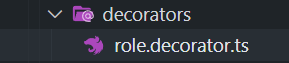

# setMetadata for Role

زمانی که بخوایم دستسرسی رو مشخص کنیم که چه کسی می تونه
setMetadata دسترسی داشته باشه نیاز داریم که یک api به یک
اضافه کنیم

## SetMetadata

یک دکوریتور درونی خوده نست هست که به ما برای دسترسی دادن به کاربر ها کمک می کنه
به چه چیزای در سایت دسترسی داره user که مشخص می کنیم چه authorization یا همون

به عنوان مثال فقط ادمین سایت می تونه تمامی کاربر ها رو ببینه
و به api که نوشتیم دسترسی داشته باشه

```javascript
  @SetMetadata('roles' ,['ADMIN'])
  @Get()
  users() {
    return this.userService.users();
  }

```

داشته باشیم برای یک متد SetMetadata می تونیم چند تا

که مربوط به guard که ایجاد می کنیم درون SetMetda از
هست استفاده می کنیم authorization

## create decorator

SetMetadata که داریم صدا بزنیم api به جای که مدام بخوایم به شکل زیر تک تک برای تمامی
ایجاد می کنیم decorator رو میایم یک
decorators یک فولدر ایجاد می کنیم به اسم user درون پوشه
درونش قرار میدیم user که میایم دکوریتور های مربتط با

    

یک فانکشن هست decorator در واقع هر

```javascript
export const Roles = (...roles:string[])=> {}
```

  که در واقع این دکوریتور میاد
    یدونه ست متا دیتا رو برگشت میده که رول ها رو درونش قرار داده
    و می تونیم به رول ها دسترسی داشته باشیم که لاگ گرفتیم

  
```javascript
   import { SetMetadata } from "@nestjs/common"
   export const Roles = (...roles:string[])=> {
   console.log(roles)
   return SetMetadata('roles' ,roles )
}
```
## use 

ازش user.controller حالا که ساختیم دکوریتور رو  میایم درون 
استفاده می کنیم 


به جای که اینجوری استفاده کنیم : 

```javascript
  @SetMetadata('roles' ,['ADMIN'])
  @Get()
  users() {
    return this.userService.users();
  }
```

میایم به این صورت استفاده می کنیم و ازدکوریتوری که ساختیم استفاده می کنیم 


```javascript
  // @SetMetadata('roles' ,['ADMIN'])
  @Roles('ADMIN')
  @Get()
  users() {
    return this.userService.users();
  }
```

استفاده کردیم در دکوریتور   seprator چون از 

```javascript
import { SetMetadata } from "@nestjs/common"

export const Roles = (...roles:string[])=> {
    console.log(roles)
    return SetMetadata('roles' ,roles )
}

```
لاگی که داخل ترمینال داریم 

```javascript
[ 'ADMIN', 'USER' ]
```

می تونیم هر مقدار دیگه ای به دکوریتور رول پاس بدیم
```javascript
  // @SetMetadata('roles' ,['ADMIN'])
  @Roles("ADMIN" ,"USER")
  @Get()
  users() {
    return this.userService.users();
  }
```

## guard
در فایل بعدی یک گار تعریف می کنیم که بتونیم از این رول و ست متا دیتای که گذاشتیم 
استفاده کنیم 
دسترسی میگیریم به رول ها و مبینیم چه رولی هست و اگر رول مناسب بود اجازه داره درخواست بزنه 
api به 
در واقع تعیین می کنیم که اجازه درخواست زدن داره یا نه

# END 

`پایان این بخش`
