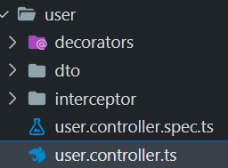

# setMetadata for Role

زمانی که بخوایم دستسرسی رو مشخص کنیم که چه کسی می تونه به یک api دسترسی داشته باشه 

میایم از setMetadata استفاده می کنیم تا دسترسی ها رو مشخص کنیم 


## SetMetadata

یک  decorator درونی خوده nestjs هست که به ما برای دسترسی دادن به کاربر ها کمک می کنه

به چه مواردی در سایت دسترسی داره به عنوان مثال فقط ادمین سایت می تونه تمامی کاربر ها رو ببینه

و به api که نوشتیم برای تمامی کاربر ها  دسترسی داشته باشه

```javascript
  @SetMetadata('roles' ,['ADMIN'])
  @Get()
  users() {
    return this.userService.users();
  }

```

داشته باشیم برای یک متد SetMetadata می تونیم چند تا

که مربوط به guard که ایجاد می کنیم درون SetMetda از

هست استفاده می کنیم authorization

## create decorator

وقتی که  SetMetadata  داریم استفاده می کنیم  جای که مدام بخوایم به شکل زیر تک تک برای تمامی api بیایم SetMetadata رو صدا بزنیم 

یک decorator ایجاد می کنیم و ازش استفاده می کنیم 

در پوشه user یک فولدر ایجاد می کنیم به اسم decorator که درون decorator های مرتبط با user قرار میدیم


    


```javascript
export const Roles = (...roles:string[])=> {}
```

  که در واقع این دکوریتور میاد
  
 یدونه setMetadata رو برگشت میده که roles رو درونش قرار داده
    
 و می تونیم به role ها دسترسی داشته باشیم که لاگ گرفتیم

  
```javascript
   import { SetMetadata } from "@nestjs/common"
   export const Roles = (...roles:string[])=> {
   console.log(roles)
   return SetMetadata('roles' ,roles )
}
```
## use 

از decorator که ساختیم میایم درون user.controller.ts استفاده می کنیم .



به جای که اینجوری استفاده کنیم : 

```javascript
  @SetMetadata('roles' ,['ADMIN'])
  @Get()
  users() {
    return this.userService.users();
  }
```

میایم به این صورت استفاده می کنیم و از decorator @Role  که ساختیم استفاده می کنیم 


```javascript
  // @SetMetadata('roles' ,['ADMIN'])
  @Roles('ADMIN')
  @Get()
  users() {
    return this.userService.users();
  }
```

از seprator استفاده کردیم که بتونیم به تمامی role ها دسترسی داشته باشیم :

```javascript
import { SetMetadata } from "@nestjs/common"

export const Roles = (...roles:string[])=> {
    console.log(roles)
    return SetMetadata('roles' ,roles )
}

```
لاگی که داخل ترمینال داریم 

```javascript
[ 'ADMIN', 'USER' ]
```

می تونیم هر مقدار دیگه ای به Roles@  بدیم
```javascript
  // @SetMetadata('roles' ,['ADMIN'])
  @Roles("ADMIN" ,"USER")
  @Get()
  users() {
    return this.userService.users();
  }
```

## guard
در فایل بعدی یک guard تعریف می کنیم که بتونیم از این رول و ست متا دیتای که گذاشتیم استفاده کنیم 


دسترسی میگیریم به role ها و مبینیم چه role هست و اگر role مناسب بود اجازه داره درخواست بزنه به api

در واقع تعیین می کنیم که اجازه درخواست زدن داره یا نه

# END 

`پایان این بخش`
