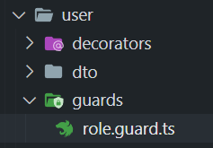

# Guard for Roles 

در این بخش می خوایم  یک گارد تعریف کنیم 
برای دکوریتور رول که در بخش قبلی ایجاد کردیم 
ایجاد می کنیم  guards یک فولدر به اسم  

در پوشه user میایم یک فولدر اضافه می کنیم به اسم guards . 

که می خوایم guard های مربوط به user رو قرار بدیم . 

که یک فایل به اسم role.guards.ts داریم درون پوشه guard . 




## dfine guard

درون فایل role.guards.ts یک کلاس ایجاد می کنیم و export می کنیم 

همینطور نیاز هست implements شه از CanActivate به این دلیل که 


```javascript
@Injectable()
export class RoleGuard implements CanActivate { }
```

نیاز هست از ExecutionContext استفاده کنیم

 برای دستسری به متد  switchToHttp که بتونیم به getRequset دسترسی داشته باشیم .

 در واقع به وسیله getRequset به requset های که زده میشه دسترسی داریم .


```javascript
import { CanActivate, Injectable, ExecutionContext } from '@nestjs/common';
@Injectable()
export class RoleGuard implements CanActivate {
    canActivate(context: ExecutionContext) {
  }
}
```

در ادامه می تونیم به اطلاعاتی user که داره requset می زنه دسترسی داشته باشیم 

```javascript
import { CanActivate, Injectable, ExecutionContext } from '@nestjs/common';
@Injectable()
export class RoleGuard implements CanActivate {
    canActivate(context: ExecutionContext) {
    const {user} = context.switchToHttp().getRequest();
    //* Guards always return true or false , 
    return true;
  }
}
```

در کد زیر به اطلاعات user دسترسی داریم : 

```
const {user} = context.switchToHttp().getRequest();
```

**نکته canAtivate همیشه true / false رو return می کنه غیر از این به اررو مواجه میشیم true / false بدون به معنی اجازه رد شدن و نشدن هست**

**نکته اینجا به این دلیل به اطلاعات user دسترسی داریم چون یک JwtAuthGuard ساختیم که وظیفه اش اضافه کردن اطلاعات کاربر به Requset هست بدون JWtAuthGuard به اطلاعات کاربر در requset دسترسی نداریم**

## using role guard

برای استفاده از role که ساختیم دورون user.controller.ts ازش استفاده می کنیم 


به اینصورت که بعد از JWTAuthGuard قرارش میدیم درون UseGuards@ 

```javascript
  //* add jwtAuath Guard and role guard for guard setmetada authrozation
  @UseGuards(JwtAuthGuard , RoleGuard)
  @Roles("ADMIN" )
  @Get()
  users() {
    return this.userService.users();
  }
```

در واقع RoleGuard به وسیله requset میاد کاربری که درخواست زده رو

مشخصات شو میگیره که به requset به وسیله jwtAuathGuard دستسرسی داریم 

مرحله بعدی که انجام میدیم این هست که درون @Roles میایم role های که می تونن دسترسی داشته باشند رو مشخص می کنیم 

```
@Roles("ADMIN" )
```
و درون RoleGuard میایم به role که مشخص شده دسترسی میگیریم . 

```
@UseGuards(JwtAuthGuard , RoleGuard)
```
چک می کنیم اگر کاربری که لاگین شده role که داره با role که مشخص شده 

یکی بود میایم میگیم که اجازه عبور داره در غیر اینصورت اجازه عبور نمیدیم 

## change login

درون auth.controller در login/ میایم یک role اضافه می کنیم که role user رو میگیره . 

```javascript
  @Post('/login')
  // @UseGuards(AuthGuard('local'))
  @UseGuards(LocalAuthGuard)
  async login(@Body() body: LoginUserDto, @Request() req) {
    const token = this.jwtService.sign({
      id: req.user.id,
      email: req.user.email,
      role:req.user.role,
    });
```

برای اینکه بتونیم درون role.guard.ts به role کاربری که لاگین کرده دسترسی داشته باشیم درون Jwtstrategy.ts نیاز هست درون validate که داره بگیم role کاربر رو هم برگشت بده 


درون validate گفتیم همراه با id , email بیاد role هم برگشت بده 

```javascript
  async validate(payload: { id: string; email: string , role:string}) {
    console.log(payload , ' payload')
    await this.Authservice.validateUserByToken(payload.id);
    return { id: payload.id, email: payload.email  , role:payload.role};
    // return user;
  }
```

در این قسمت : 
```
return { id: payload.id, email: payload.email  , role:payload.role};
```

به این دلیل که گفتم role.guard میاد اطلاعات رو از JwtAuthGuard میگیره و  این JwTAuthGuard متصل هست به jwtStrategy که jwtStartegy میاد اطلاعات کاربر رو درون Requset ذخیره می کنه . در نهایت درون role.guard به وسیله ()switchToHttp().getRequest به Requset دسترسی داریم و می تونیم اطلاعات کاربر رو مشاهده کنیم . 

```javascript
// in role.guard.ts
import { CanActivate, Injectable, ExecutionContext } from '@nestjs/common';
@Injectable()
export class RoleGuard implements CanActivate {
    canActivate(context: ExecutionContext) {
    const {user} = context.switchToHttp().getRequest();
    //* Guards always return true or false , 
    return true;
  }
}
```

در قسمت بعدی میایم مقایسه رو انجام میدیم role که درون requset گرفتیم

که در واقع role user هست که login کرده رو مقایسه می کنیم با role که 

درون decorator Role گذاشتیم . 

```
// decorator role in user.controller.ts
  @Roles("ADMIN" )
```
اگر هر دو role یکی بودند میایم اجازه دسترسی رو میدیم . 

در غیر اینصورت اگر Role ها متفاوت بودن اجازه دسترسی رو نمیدیم . 


# Summary 

در این بخش از Setmetadata استفاده کردیم در نهایت برای SetMetadata

یک decorator به اسم Role ایجاد کردیم درون فولدر user 

در ادامه یک role.guard.ts ایجاد کردیم درون فولدر user 

از guard که ساختیم در user.controller.ts درون UseGuard@ استفاده 

کردیم کنار JwtAuthGuard . 

وظیفه RoleGuard که ایجاد کردیم مقایسه role کاربر ها هست 

که به وسیله  Requset به اطلاعات و role کاربر دسترسی میگیره با role که 

درون decorator role که ست کردیم میاد مقایسه رو انجام میده که این 

مقایسه رو در بخش بعدی عملی کردیم 

# End 

`پایان بخش SetMetadata و تعریف کردن یک RoleGuard برای user`
